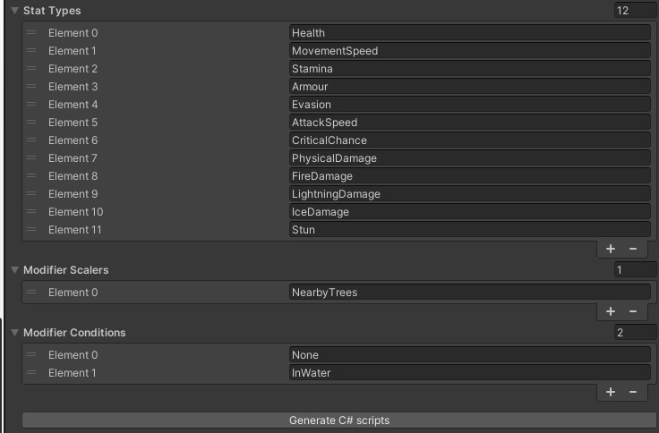

# Stat Configuration

The StatConfiguration asset is where you will configure the constants of your stat system.

You can create an instance of this scriptable object in your project with:\
Right Click -> Create -> DeepStats -> StatConfiguration

It is recommended to only have one of these assets in your project, as it will be used to generate the necessary code which the rest of DeepStats will depend on.

A StatConfiguration has the following properties:

### Stat Types
These are the Stat Types you'll be using in your project. If it's a numeric value you want to modify in your game, DeepStats is probably a good place for it.\
Some examples:
- Classic RPG stats: Maximum Health, Damage, Speed, Armour, Agility, Strength etc.
- In a platformer you could add a NumberOfJumps stat so the player can unlock double-jump or triple-jump
- In a racing game you could add a Speed and Steering stat so that the player can customise their vehicle

{: .note }
Stats are calculated in the order of your StatConfiguration. This is important for dependent Modifiers such as ConvertedTo (Fire converted to Ice) / AddedAs (Fire added as Ice) to prevent circular dependencies. If you want to convert Health to Armour, make sure Health comes first in your StatConfiguration.

### Modifier Scalers
These are aspects of your gameplay that can be used to dynamically scale a Modifier value.
Some examples:
- In a racing game, you may have a vehicleDamage scaler which you could use to scale a speed Modifier and a handling Modifier
- In a survival game, you may have a hungerScore scaler which you could use to scale a max stamina Modifier and a damage Modifier

### Modifier Tags
These are less dynamic aspects of your game that can be used to create requirements for a Modifier to activate
Some examples:
- In an ARPG, you may have Human, Minion, Melee, Spell, Undead tags. These could be used to create Modifiers that only apply to the Player and not to their Minions, or to create a spell which does more damage against Undead Melee units.
- In an RTS, you may have Melee, Ranged, Armoured, Biological, Shielded tags. These could be used to create a shield upgrade Modifier for your faction that only affects Shielded units, or create a unit that has a Modifier giving it bonus damage against Armoured enemies.

{: .note }
The names for these elements can be whatever you want, except they must be compatible as a C# enum. This means elements must start with a letter or underscore, it also means no duplicates. DeepStats will also remove any whitespace and convert it to CamelCase.

Once you have finished creating these, hit the 'Generate C# scripts' button. A build will be triggered, and your Stats will be available for use in the editor and in code. You can modify the StatConfiguration and regenerate whenever you like, enums in DeepStats use Editor friendly property drawers so you can re-order and re-name them with the following caveat:

{: .warning }
If you both re-order and re-name an element before clicking Generate, references will be lost. There is no way to identify the original enum if the name has changed and the position has moved. You can avoid this issue by hitting Generate after each operation.

Remember to hit the Generate button when you're done.