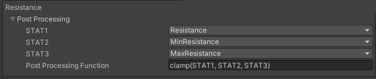

# Stat Properties

The StatProperties Scriptable Object is where you will define any post-processing operations for your stats

You can create an instance of this scriptable object in your project with:\
Right Click -> Create -> DeepStats -> StatProperties

You can have multiple versions of StatProperties, such as a regular version and a debug version for testing some stat behaviors. Swap them out by changing the referenced instance in your scene's DeepStatsManager.

{: .note }
You may want to read this section but otherwise move on and come back later. Stat Post-processing will make more sense after understanding the other components of DeepStats

A StatProperties has two post-processing configurations for each stat type:

### PostProcessing 1
This will apply to the raw value of the stat, before any final modifiers. This should be used if a stat is used in a different way before any further final Modifiers, eg. Armour Score becomes a Damage Reduction.

### PostProcessing 2
This will apply to the final value of the stat, after any final modifiers. This should be used to apply any hard limits or requirements to a stat, eg. clamping, rounding etc.

### Configuring Post Processing
Use up to 3 final stat values in a post-processing function to modify a stat value.

The expression parser will replace STAT1, STAT2 and STAT3 respectively with the Stat Type referenced in the field.

The expression parser supports the following operations:
- Add - +
- Subtract - -
- Multiply - *
- Divide - /
- Modulo - %
- Brackets for ordering - ( your_important_func )
- sine function - SIN(val)
- cosine function - COS(val)
- tan function - TAN(val)
- square root - SQRT(val)
- exponential - POW(base, power)
- round - ROUND(val)
- clamp - CLAMP(val, min, max)

If the expression is left blank, the final stat value will be the same as a the raw stat value.

### Example
Let's use an example where we have an armour score stat which eventually becomes a damage reduction percentage. In this case, the raw stat value is the armour score and the final stat value is the damage reduction. Let's say that damage reduction is a simple square root of the armour score, divided by 100. Damage reduction cannot exceed 95%.

Let's also say that the player has a Modifier which doubles your damage reduction against ranged attackers.

The PostProcessing 1 function for Armour should square root the armour score, then divide by 100 to obtain a damage reduction. \
The PostProcessing 2 function for Armour should clamp the damage reduction in case it exceeds 95%.

Now in a situation where the player has 2500 armour score and the "doubled damage reduction" modifier,

PostProcessing 1 will convert 2500 armour score -> 50% damage reduction \
The final Modifier will then double that to 100% damage reduction against ranged attackers. \
PostProcessing 2 will clamp the 100% down to 95% damage reduction against ranged attackers

