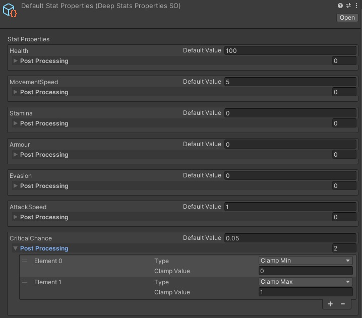
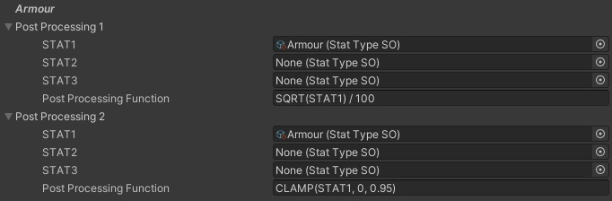
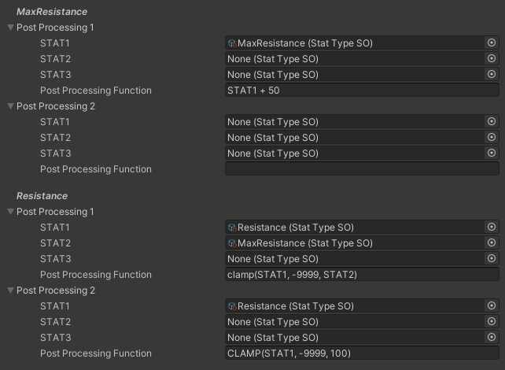

# Stat Properties

The StatProperties Scriptable Object is where you will define any post-processing operations to convert the raw stat values into a different final value.

Use cases:
- Add a default value for a Stat
- Convert a Stat value from one type into another, (eg. an armour rating into a damage reduction)
- Clamp the range of a Stat
- Round a Stat to N decimal places
- Create Stat interactions

You can create an instance of this scriptable object in your project with:\
Right Click -> Create -> DeepStats -> StatProperties

You can have multiple versions of StatProperties, such as a regular version and a debug version for testing some stat behaviors or balancing. Swap them out by changing the referenced instance in your scene's DeepStatsManager.

{: .note }
You may want to read this section but otherwise move on and come back later. Stat Post-processing will make more sense after understanding the other components of DeepStats

A StatProperties has two post-processing configurations for each stat type:

### PostProcessing 1
This will apply to the raw value of the stat, before any final modifiers. This should be used if a stat is used in a different way before any further final Modifiers, eg. Armour Score becomes a Damage Reduction.

### PostProcessing 2
This will apply to the final value of the stat, after any final modifiers. This should be used to apply any hard limits or requirements to a stat, eg. clamping, rounding etc.

### Configuring Post Processing
Use up to 3 raw stat values in a post-processing function to obtain a final stat value.

The expression parser will replace STAT1, STAT2 and STAT3 respectively with the Stat Type referenced in the field.

The expression parser supports the following operations:
- Add: +
- Subtract:
- Multiply: *
- Divide: /
- Modulo: %
- Brackets for ordering: ( your_important_func )
- sine function: SIN(val)
- cosine function: COS(val)
- tan function: TAN(val)
- square root: SQRT(val)
- exponential: POW(base, power)
- round: ROUND(val)
- clamp: CLAMP(val, min, max)

If the expression is left blank, the final stat value will be the same as a the raw stat value.

### Example 1: Armour to Damage Reduction
Let's use an example where we have the following requirements for an Armour Score stat which is turned into a Damage Reduction percentage. 
- The Damage Reduction formula is a square root of the Armour score, divided by 100. 
- Damage reduction cannot ever exceed 95%.

To fulfil these requirements:
1. The PostProcessing 1 function for Armour should square root the armour score, then divide by 100 to obtain a damage reduction. \
2. The PostProcessing 2 function for Armour should clamp the damage reduction in case it exceeds 95%.

Here's how Damage Reduction will get calculated when the player has 2500 Armour and a modifier which adds 2x final Damage Reduction:
1. PostProcessing 1 will convert 2500 Armour:> 50% Damage Reduction.
2. The final Modifier will then double that to 100% Damage Reduction against ranged attackers.
3. PostProcessing 2 will clamp the 100% down to 95% Damage Reduction against ranged attackers.

### Example 2: Dynamic Stat Limits
Consider a damage Resistance system where there is a limit on how high Resistance can go, but that limit can also be Modified in special situations.
- Default Max Resistance is 50%
- Max Resistance can be modified up to 100%
- The players Resistance can be modified up to Max Resistance

To fulfil these requirements:
1. The PostProcessing 2 function for Max Resistance should +50, then clamp it between 0 and 100
2. The PostProcessing 2 function for Resistance should clamp it between 0 and Max Resistance

Here's how Resistance will get calculated when the player has 100% Resistance, and +25% Max Resistance
1. Max Resistance will be adjusted from 50% to 75%
2. Max Resistance will be clamped between 0 and 100% by Post Processing 2 on Max Resistance, so will remain unchanged at 75%
3. Resistance will be clamped between 0 and Max Resistance (75%) to a final value of 75%

