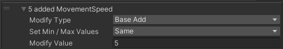
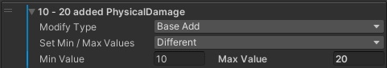
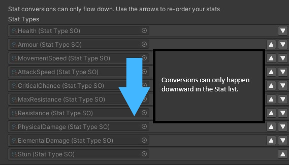

# Getting Started

## What is a Stat?
A stat is some numerical value in your game which you'll use to drive other behavior, eg.
- A Speed stat can used in your CharacterController to set how fast your character moves
- A Health stat can used in your UnitController to set your characters maximum health

Stats can be affected by Modifiers which change the final value of the Stat. Some Modifiers may alter the base value of a Stat, others will multiply the base value by some amount. Some modifiers can interact with other Stats such as a conversion from one Stat into another.

Modifiers can be affected by Modifier Scalers which will alter the modifier value, allowing you to create dynamic modifiers that depend on your gameplay.

Modifiers can also be conditionally applied by comparing against Modifier Conditions, allowing you to enable / disable modifiers on the fly.

## All Stats are have a min and max value

In order to support a common RPG feature of random stat ranges (deals 5-10 damage etc.) without having to create modifiers for each min and max value, DeepStats uses stat ranges for all Stats. Modifiers can set 'same' or 'different' values for the min and max modification. If you don't want a stat to have a range, you can leave all modifiers at 'same' so that the random final value is always the same.





## Stats are calculated in the order of your StatConfiguration

This is important for dependent Modifiers such as ConvertedTo (Fire converted to Ice) / AddedAs (Fire added as Ice) to prevent circular dependencies. If you want to convert Health to Armour, make sure Health comes first in your StatConfiguration.



## Quickstart

If you're not interested in the details and happy to experiment, the following guide will get DeepStats into your game in the shortest time.

### Step 1: Import the package
Window -> Package Manager -> Find Deepstats, import. You can exclude the Demo folder if you don't want it. 

If you're going to include the demo folder, it is recommended to import DeepStats into a new project to avoid script errors if you modify the stat configuration.

### Step 2: Create a StatConfiguration
Find the place in your project that you want to store DeepStats data. 

Right click -> Create -> DeepStats -> Stat Configuration.

Add the stat names to the Stat Types list. They must be unique and a valid name for a C# enum (it will make some attempt to clean up whitespace and capitalisation for you on generation).\
Optional: Add any scalers you might expect to use, these are things that may scale a modifier such as "NearbyTrees", "Number of active poisons"\
Optional: Add any conditions you might expect to use, these are things such as "HasBoost", "InWater"

When you're done, click the "Generate C# scripts" button.

### Step 3: Create a StatProperties
In the same folder as your stat configuration, 

Right click -> Create -> DeepStats -> Stat Properties. This is where you will set default values for your stats, and configure any post-processing.

The default value will be the initial base value for all instances. 
Use postprocessors to modify the final value of a stat after modifiers.

Most projects will only need one StatProperties, although it can be useful for debugging to swap this out sometimes, for example if you're testing extreme values of a stat.

### Step 4: Initialise your scene
Open the scene that will be using DeepStats. 

Then in the toolbar at the top of the Unity Editor, Tools -> DeepStats -> Initialise Scene. This will add a DeepStatsManager gameObject.

Open DeepStatsManager, drag your StatProperties Scriptable Object into the reference slot.

### Step 5: Create a script with DeepStats on it

This could be your player, enemies, a weapon, anything.

```
    public class DeepStatsClass : MonoBehaviour
    {
        public List<EditorDeepModifier> Modifiers;

        private DeepStats _stats;
        private DeepConditions _conditions;

        public void Awake()
        {
            _stats = new DeepStats();
            _conditions = new DeepConditions();

            foreach (var m in Modifiers)
            {
                _stats.AddModifier(m.Value);
            }

            _stats.UpdateFinalValues(_conditions, null);

            for (var i = 0; i < DeepStatsConstants.NumStatTypes; i++)
            {
                var statType = (StatType)i;
                var value = _stats.GetFinalValue(statType);
                Debug.Log($"{statType}: {value}");
            }
        }

        private void OnDestroy()
        {
            _stats.Dispose();
            _conditions.Dispose();
        }
    }
```

### Step 6: Use DeepStats
Add some modifiers to the Modifiers array in the editor. When you run your game, you'll see the calculated stat values in the console logs.
