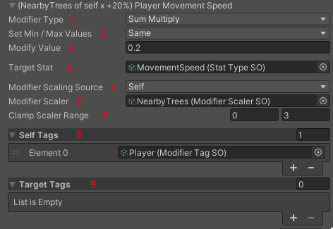
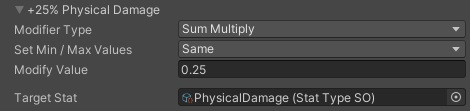
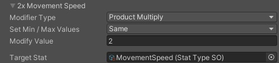
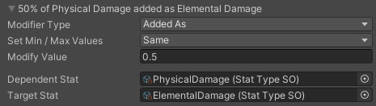
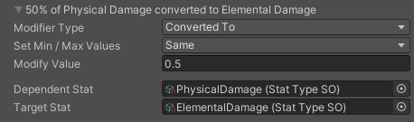
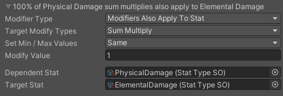
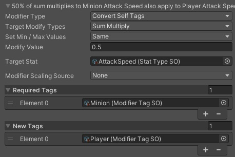
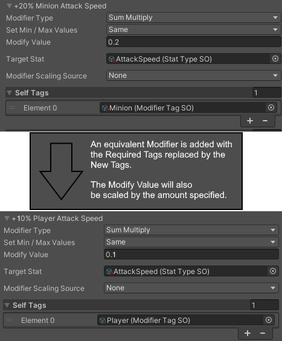
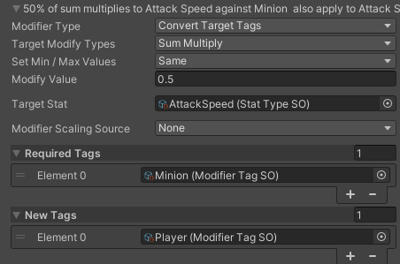

# EditorDeepModifier

This is the authoring class for creating Modifiers via the Unity Editor. Use it's custom editor to create a wide range of Modifiers. Modifiers can be added to DeepStats and DeepModifierCollections

## Modifier Overview

1. Modifier Type: The type of modification to the Stat you want to make.
2. Set Min / Max Values: Whether you'll be modifying the min and max value of the Stat separately.
3. Modify Value: The magnitude to apply this Modifier.
4. Target Stat: Which Stat you want to modify.
5. Modifier Scaling Source: Whether you want to scale the Modify Value. 'Self' will use a Scaler from the DeepStats with this Modifier, 'Target' will use a Scaler from a Target DeepStats passed in when calculating stats. You can also use both, in which case they Scalers will be added together.
6. Modifier Scaler: Which Scaler value to look up.
7. Clamp Scaler Range: The min and max values to clamp the Scaler to.
8. The required Tags on the DeepStats instance that has this Modifier for this Modifier to apply
9. The required Tags on the Target DeepStats instance passed in when calculating stats, for this Modifier to apply.

## Types of Modifiers

### Add
 Adds a flat value to the target stat.  
 eg. `TargetStat + 5`

### SumMultiply
Adds a value with all the other SumMultiply mods, before multiplying the target stat.  
eg. `TargetStat * (1 + mod1 + mod2 + mod3 + ...)` 

### ProductMultiply
Multiplies the target stat by a value.  
eg. `TargetStat * 2`

### AddedAs
Multiplies the raw value of DependentStat by a value and adds it to the final TargetStat value.  
eg. `TargetStat + DependentStat * 0.5`

### ConvertedTo
Multiplies the raw value of DependentStat by a value and adds it to the final TargetStat value.  
The DependentStat will be reduced by the same amount. 
eg. `TargetStat + DependentStat * 0.5`

{: .note }
You cannot convert more than 100% of a Stat. If total conversion exceeds 100%, all conversion Modifiers will be scaled down equally so that the sum is 100%.

### ModifiersAlsoApplyToStat
Takes the total modifications to each Target Modify Type from Dependent Stat, and accumulates them onto Target Stat.

### ConvertSelfTags
Finds any Modifiers which have the Required Tags under Self and creates a copy of them with Required Tags replaced by New Tags.

For example, the Modifier below would have a second version added that requires a Player tag instead of a Minion Tag.

### ConvertTargetTags
Functions the same as ConvertSelfTags, except it searches for Tags in the Target section instead.

### FinalAdd, FinalSumMultiply, FinalSumMultiply
These operate the same as the non-final Modifier types, except they apply between PostProcessing 1 and 2. They can be used to Modify a Stats' final value.

## Order of operations for Stat Calculation
Stat calculations happen in the following order:
1. All 'Add' Modifiers are summed together.  
`Added = mod1 + mod2 + mod3 + ...`
2. Starting with a value of 1, all 'SumMultiply' Modifiers are added. The result is multiplied by the previous value.  
`SumMultiplied = (1 + mod1 + mod2 + mod3 + ...) * Added`
3. Starting with a value of 1, all 'ProductMultiply' Modifiers are multiplied. The result is multiplied by the previous value.  
`ProductMultiplied = mod1 * mod2 * mod3 * SumMultiplied`
4. Any conversions or additions TO this StatType are then added.  
`AddedSources = ProductMultiplied + AddedStats + ConvertedStats`
5. Any conversions FROM the StatType are then removed.  
`RawValue = AddedSources * totalConversionFraction`
6. Raw value is now complete.
7. PostProcessing 1 is applied to raw value.  
`pp1 = postprocessing1(RawValue)`
8. 'Final' type modifiers are applied.  
`finalModified = (pp1 + finalAdd) * (1 + finalSum1 + finalSum2 + finalSum3 + ...) * finalProduct1 * finalProduct2 * finalProduct3 * ...`
9. PostProcessing 2 is applied.  
`finalValue = postprocessing2(finalModified)`
10. Final value is now complete.