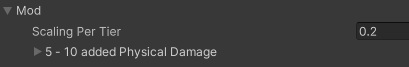
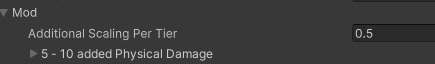

# Other Modifier Types
DeepStats also includes a number of extensions to the EditorDeepModifier to support common use-cases. They demonstrate some ways that you can extend a DeepModifier for more advanced use-cases, or you can use them as-is.

## TieredModifier



This Modifier extension provides a way to create a tiered set of modifiers built from the same base modifier. Simply call the function on it GetTieredModifier() and pass in which tier, to get a DeepModifier where the 'value' is scaled up by your "Scaling Per Tier". Use this to create one base mod, then do things such as:
- randomly roll a tier when creating items to add additional item variety
- Add an upgrade system for items by increasing the tiers of existing modifiers

This class is included, or modify it further to meet the requirements of your own game
```cs
    [System.Serializable]
    public class TieredModifier
    {
        public float ScalingPerTier = 0.2f;
        public EditorDeepModifier TemplateModifier;

        public DeepModifier GetTieredModifier(int tier)
        {
            var newMod = TemplateModifier.Value;
            newMod.ModifyValue = newMod.ModifyValue * (1 + tier * ScalingPerTier);
            return newMod;
        }
    }
```

## TieredRandomizedModifier



Similar to the previous TieredModifier, this also provides a way to create new modifiers from the same base. Call the GetTieredModifier() function to get a new DeepModifier, where the 'value' increases to the new tier, with an additional random range within the tier.

This class is included, or modify it further to meet the requirements of your own game
```cs
    [System.Serializable]
    public class TieredRandomizedModifier
    {
        public float AdditionalScalingPerTier;
        public EditorDeepModifier TemplateModifier;

        public DeepModifier GetTieredModifier(int tier)
        {
            var newMod = TemplateModifier.Value;

            var baseValue = newMod.ModifyValue;
            var fixedIncrease = newMod.ModifyValue * AdditionalScalingPerTier * (tier - 1);
            var randomComponent = UnityEngine.Random.Range(0f, 1f) * newMod.ModifyValue * AdditionalScalingPerTier;

            newMod.ModifyValue = baseValue + fixedIncrease + randomComponent;

            return newMod;
        }
    }
```